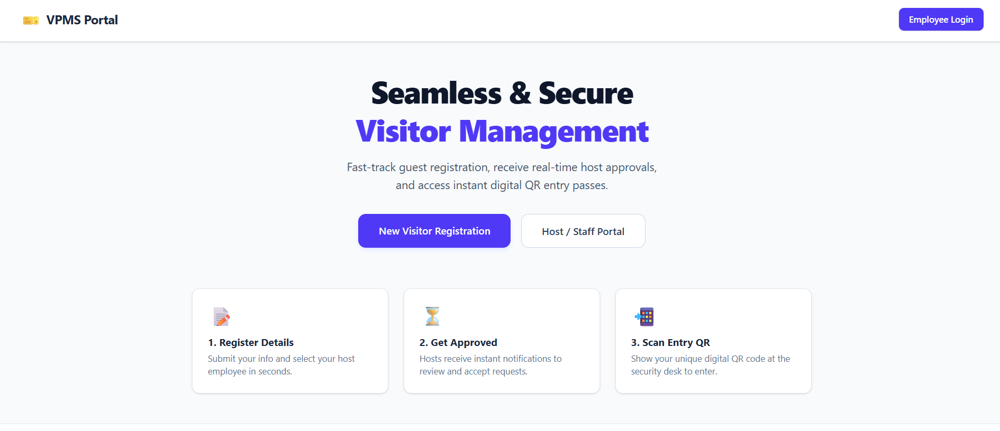
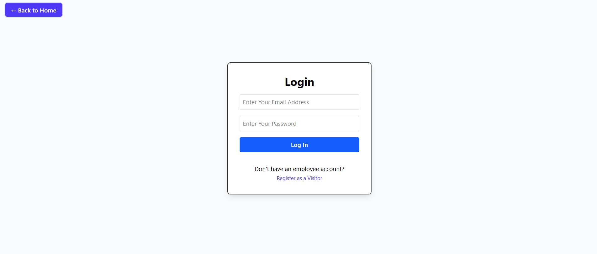
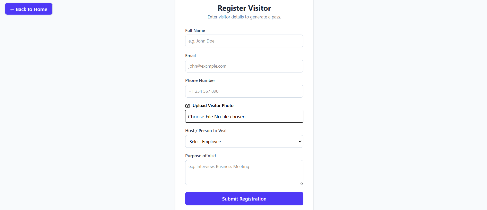
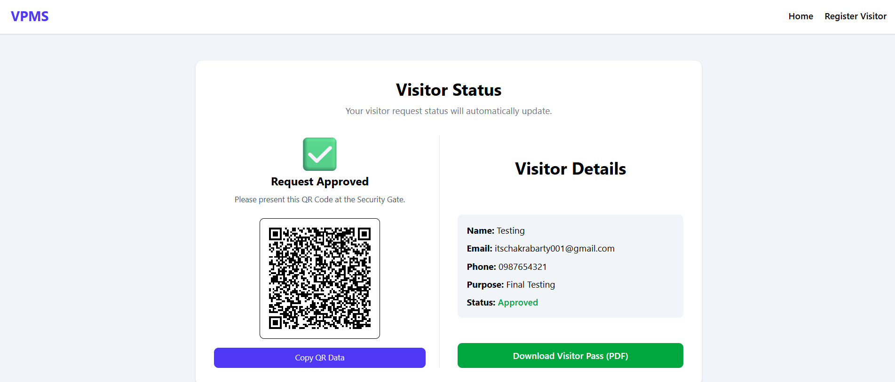
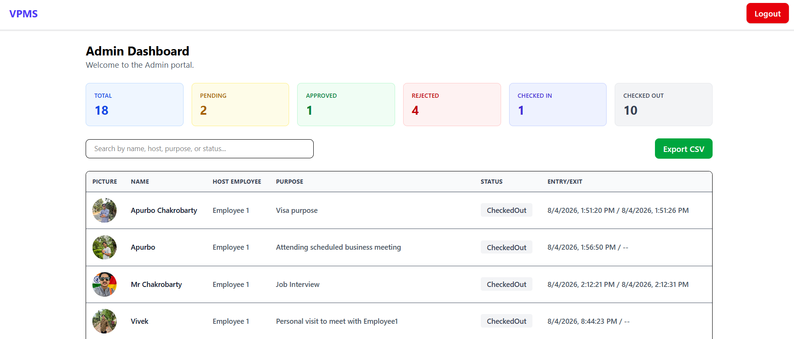
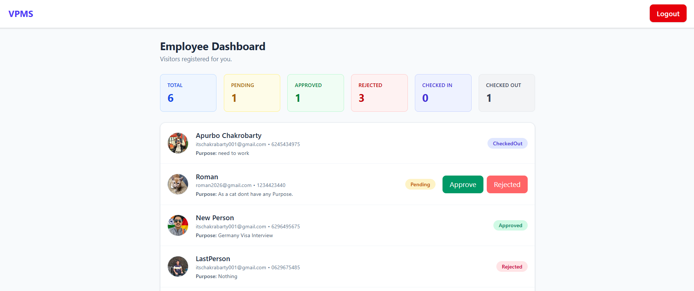
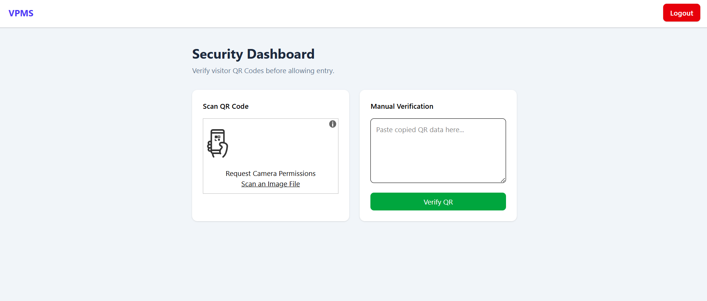

# 🎟️ Visitor Pass Management System (VPMS)

A full-stack **MERN Stack** solution that digitizes manual visitor logs into a secure, paperless workflow featuring pre-registration, multi-role approvals, instant QR verification, and automated PDF pass generation.

## 📂 Project Structure

```
Client/
├── src/
│   ├── components/
│   ├── pages/
│   ├── services/
│   └── App.jsx

Server/
├── config/
├── controllers/
├── middleware/
├── models/
├── routes/
├── uploads/
└── server.js
```

---

## ⚡ Workflow Pipeline

Visitor Registration
⬇️
Employee Approval
⬇️
QR Code & PDF Pass
⬇️
Security Check-In
⬇️
Check-Out

## 👥 Role Matrix

| Role         | Key Features                                                                                          |
| :----------- | :---------------------------------------------------------------------------------------------------- |
| **Visitor**  | Pre-registers details, uploads profile photo, tracks live approval status, downloads digital PDF pass |
| **Employee** | Reviews assigned visit requests, approves or rejects appointments                                     |
| **Security** | Verifies visitor QR codes, manages real-time Check-In and Check-Out actions                           |
| **Admin**    | Accesses global metrics, entry/exit logs, search filters, and exports visitor data to CSV             |

---

## 🛠️ Tech Stack & Utilities

| Domain       | Technologies                                                                |
| :----------- | :-------------------------------------------------------------------------- |
| **Frontend** | React.js, React Router DOM, Axios, Tailwind CSS, Lucide Icons               |
| **Backend**  | Node.js, Express.js, MongoDB Atlas, Mongoose, JWT, bcrypt                   |
| **Services** | Multer (File Uploads), Nodemailer (Emails), QRCode, PDFKit (PDF Generation) |

---

## 🚀 Quick Start

### 1. Installation

```bash
# Backend Setup
cd Server
npm install

# Frontend Setup
cd ../Client
npm install
```

### 2. Environment Configuration

Create a .env file in the Server directory:

```env
PORT=5000
MONGO_URI=your_mongodb_connection_string
JWT_SECRET=your_jwt_secret_key
EMAIL=your_email@gmail.com
EMAIL_PASS=your_gmail_app_password
```

### 3. Run Application

```bash
# Backend
npm start

# Frontend
npm run dev
```

## 💡 Engineering Highlights

- Role-based authentication using JWT.
- Dynamic QR Code generation after employee approval.
- PDF Visitor Pass generation with downloadable visitor details.
- Automated email notifications after approval or rejection.
- Visitor lifecycle management (Pending → Approved → Checked-In → Checked-Out).

# Challenges Faced

## During the development of this project, I faced several practical challenges:

- Designing a complete workflow between **Admin, Employee, Security, and Visitor** while maintaining proper role-based access.
- Understanding how to upload and store visitor photos using **Multer** and serve them correctly to the frontend.
- Learning how **JWT Authentication** works and handling expired tokens.
- Integrating **QR Code generation** and using it for visitor verification.
- Generating a downloadable **PDF Visitor Pass** containing visitor information and QR Code.
- Implementing **Email Notifications** using Nodemailer and configuring Gmail App Passwords.
- Handling frontend-backend communication using Axios and debugging API errors.
- Managing different visitor status transitions such as:
  - Pending
  - Approved
  - Rejected
  - Checked-In
  - Checked-Out
- Designing dashboards for different user roles while displaying only relevant information.
- Improving validation for user inputs such as email format, phone number, and image uploads.

# What I Learned

Through this project I learned:

- Building a complete MERN application from scratch.
- Authentication and Authorization using JWT.
- File Uploads using Multer.
- QR Code generation and verification.
- PDF generation.
- Sending Emails using Nodemailer.
- Managing multiple user roles.
- Designing a complete workflow instead of only CRUD operations.
- Debugging backend and frontend issues effectively.

Most of these challenges were completely new to me, so I spent time understanding the concepts before integrating them into the project.

## 🔮 Future Enhancements

- Camera-based Live QR Scanner
- SMS / WhatsApp Notifications
- Analytics Dashboard
- Docker Deployment

# 👤 Author

## Apurbo Chakrobarty

### B.Sc. Computer Science — University of North Bengal

### 📄 License

- This project is developed for educational purposes.

## 📷 Screenshots

### Home Page

<p align="center">
  
</p>

### Login Page

<p align="center">
  
</p>

### Visitor Registration

<p align="center">
  
</p>

### Visitor Room

<p align="center">
  
</p>

### Admin Dashboard

<p align="center">
  
</p>

### Employee Dashboard

<p align="center">
  
</p>

### Security Dashboard

<p align="center">
  
</p>
## 🎥 Demo

(Add Google Drive / YouTube link)
